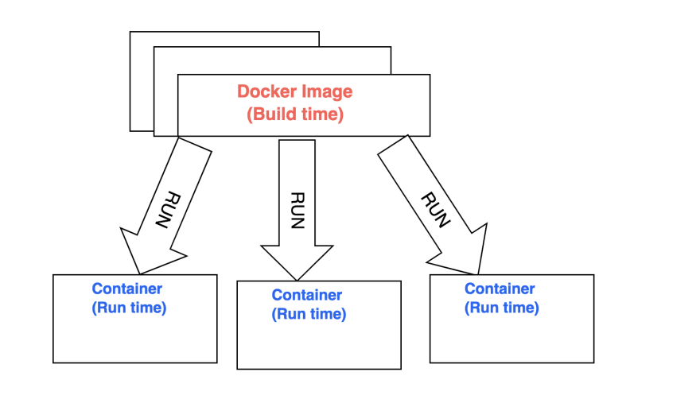

## Install

### Linus

```bash
# sudo 普通用户希望用root权限执行
# wget 下载命令
# -qO(字母) 限制输出跟普通输出
# | sh 用SH的方式执行

sudo wget -qO- https://get.docker.com | sh

# 这个命令的意思是把当前用户加入docker用户组。
sudo usermod -aG docker 用户名

# 安装 docker-compose
curl https://github.com/docker/compose
```

### CentOS

```shell
# CentOS7 系统 CentOS-Extras 库中已带 Docker，可以直接安装：
$ sudo yum install docker

# 安装之后启动 Docker 服务，并让它随系统启动自动加载。
$ sudo service docker start

$ sudo chkconfig docker on
```

## Use Docker

For that we need to familiarise ourselves with certain terminology.



**Docker image**: It is an executable file which contains cutdown operating system and all the libraries and configuration needed to run the application. It has multiple layers stacked on top of each other and represented as single object. A docker image is created using docker file, we will get to that in a bit.

**Docker Container**: It is a running instance of docker image. there can be many containers running from same docker image.

### Dockerfile

Environment variables are supported by the following list of instructions in the [Dockerfile](https://docs.docker.com/engine/reference/builder/):

-   ADD
-   COPY
-   ENV
-   EXPOSE
-   FROM
-   LABEL
-   STOPSIGNAL
-   USER
-   VOLUME
-   WORKDIR

For example

```Dockerfile
# pulls node.js docker image from docker hub
FROM node:8

# The ARG instruction defines a variable
# that users can pass at build-time to the builder with the
# `docker build` command using the --build-arg <varname>=<value> flag.
# docker build --build-arg ENV_TAG=prod .
ARG ENV_TAG
ENV ENV_TAG ${ENV_TAG}
WORKDIR /app
COPY package.json /app
RUN npm install
COPY . /app
EXPOSE 8081
CMD node index.js
```

## Containerise

We would try to containerise very node.js simple app, and create a image:

### Your Node.js App

Let’s start by creating folder my-node-app ,

```bash
mkdir my-node-app
cd my-node-app
```

let ‘s create a simple node server in index.js and add following code there:

```js
//Load express module with `require` directive

var express = require('express');

var app = express();

//Define request response in root URL (/)
app.get('/', function(req, res) {
    res.send('Hello World!');
});

//Launch listening server on port 8081
app.listen(8081, function() {
    console.log('app listening on port 8081!');
});
```

and save this file inside your my-node-app folder.

Now we create a `package.json` file and add following code there:

```json
{
    "name": "helloworld",
    "version": "1.0.0",
    "description": "Dockerized node.js app",
    "main": "index.js",
    "author": "",
    "license": "ISC",
    "dependencies": {
        "express": "^4.16.4"
    }
}
```

At this point you don’t need express or npm installed in your host, because remember dockerfile handles setting up all the dependencies, lib and configurations.

### DockerFile

Let’s create dockerfile and save it inside our `my-node-app` folder. This file has no extension and is named `Dockerfile` . Let go ahead and add following code to our dockerfile.

```Dockerfile
# Dockerfile
FROM node:8
WORKDIR /app
COPY package.json /app
RUN npm install
COPY . /app
EXPOSE 8081
CMD node index.js
```

-   **FROM node:8** - pulls node.js docker image from docker hub, which can be found here https://hub.docker.com/_/node/
-   **WORKDIR /app** - this sets working directory for our code in image, it is used by all the subsequent commands such as `COPY` , `RUN` and `CMD`
-   **COPY package.json /app** -this copies our `package.json` from host `my-node-app` folder to our image in `/app` folder.
-   **RUN npm install** — we are running this command inside our image to install `dependencies` (node_modules) for our app.
-   **COPY . /app** — we are telling docker to copy our files from `my-node-ap`p folder and paste it to `/app` in docker image.
-   **EXPOSE 8081** — we are exposing a port on the container using this command. Why this port ? because in our server in index.js is listening on 8081. By default containers created from this image will ignore all the requests made to it.

### Build Docker Image

Show time. Open terminal , go to your folder my-node-app and type following command:

```shell
# Build a image docker build -t <image-name> <relative-path-to-your-dockerfile>

docker build -t hello-world .
```

This command creates a hello-world image on our host.

-   **-t** is used to give a name to our image which is `hello-world` here.
-   **.** is the relative path to docker file, since we are in folder `my-node-app` we used dot to represent path to docker file.

You will see an output on your command line something like this:

```
Sending build context to Docker daemon  4.096kB
Step 1/7 : FROM node:8
    ---> 4f01e5319662
Step 2/7 : WORKDIR /app
    ---> Using cache
    ---> 5c173b2c7b76
Step 3/7 : COPY package.json /app
    ---> Using cache
    ---> ceb27a57f18e
Step 4/7 : RUN npm install
    ---> Using cache
    ---> c1baaf16812a
Step 5/7 : COPY . /app
    ---> 4a770927e8e8
Step 6/7 : EXPOSE 8081
    ---> Running in 2b3f11daff5e
Removing intermediate container 2b3f11daff5e
    ---> 81a7ce14340a
Step 7/7 : CMD node index.js
    ---> Running in 3791dd7f5149
Removing intermediate container 3791dd7f5149
    ---> c80301fa07b2
Successfully built c80301fa07b2
Successfully tagged hello-world:latest
```

As you can see it ran the steps in our docker file and output a docker image. When you try it first time it will take a few minutes, but from next time it will start to use the cache and build much faster and output will be like the one shown above. Now, try following command in your terminal to see if your image is there or not :

```bash
# Get a list of images on your host
docker images
```

it should have a list of images in your host. something like this

```
REPOSITORY    TAG      IMAGE ID      CREATED         SIZE
hello-world   latest   c80301fa07b2  22 minutes ago  896MB
```

### Run Docker Container

With our images created we can spin up a container from this image.

```bash
# Default command for this is docker container run <image-name>
docker container run -p 4000:8081  hello-world
```

This command is used to create and run a docker container.

-   **-p 4000:8081** — this is publish flag, it maps host port 4000 to container port 8081 which we opened through expose command in dockerfile. Now all the requests to host port 4000 will be listened by container port 8081.

-   **hello-world** — this is the name we gave our image earlier when we ran docker-build command.

You will receive some output like this :

```
app listening on port 8081!
```

If you want to enter your container and mount a bash terminal to it you can run

```bash
# Enter the container
docker exec -ti <container id> /bin/bash
```

In order to check if container is running or not, open another terminal and type

```bash
docker ps
```

You should see your running container like this

```
    CONTAINER ID    IMAGE        COMMAND                  CREATED
`<container id>`  hello-world  "/bin/sh -c 'node in…"   11 seconds ago

STATUS              PORTS                    NAMES
Up 11 seconds       0.0.0.0:4000->8081/tcp   some-random-name
```

It means our container with id `<container id>` created from hello-world image, is up and running and listening to port 8081.
Now our small Node.js app is completely containerised. You can run http://localhost:4000/ on your browser
